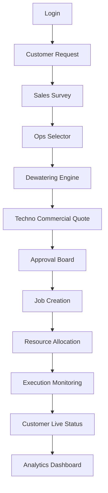

# User Flow

```mermaid
flowchart TD
A[Login] --> B[Customer Request]
B --> C[Sales Survey]
C --> D[Ops Selector]
D --> E[Dewatering Engine]
E --> F[Techno Commercial Quote]
F --> G[Approval Board]
G --> H[Job Creation]
H --> I[Resource Allocation]
I --> J[Execution Monitoring]
J --> K[Customer Live Status]
K --> L[Analytics Dashboard]
```
