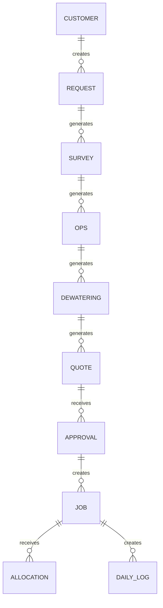

# Database Architecture

```mermaid
erDiagram

CUSTOMER ||--o{ REQUEST : creates
REQUEST ||--o{ SURVEY : generates
SURVEY ||--o{ OPS : generates
OPS ||--o{ DEWATERING : generates
DEWATERING ||--o{ QUOTE : generates
QUOTE ||--o{ APPROVAL : receives
APPROVAL ||--o{ JOB : creates
JOB ||--o{ ALLOCATION : receives
JOB ||--o{ DAILY_LOG : creates
```
